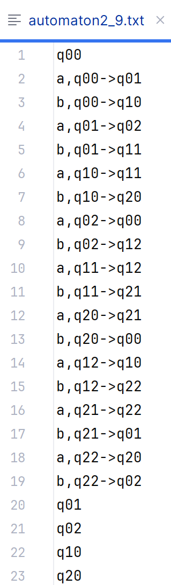

# Master Thesis

This repository contains the practical part of my master's thesis titled **Decomposition  of Regular Languages**. 
One of the main contributions is a console-based Java application that reads an automaton from a text file, performs 
a user-specified operation on it, and prints the result to the console. The application provides both classical 
functionality (i.e., permutation check, commutativity check, determinization, minimization) 
as well as primality algorithms.

For permutation DFAs, five algorithms are implemented:
1. The original algorithm from [Jecker, Mazzocchi, Wolf, 2021](#references),
2. A variant that stores processed states while generating orbit-DFAs from initial states,
3. A variant that stores processed initial states of the orbit-DFAs,
4. A variant that stores processed states of permutation DFA ([Reviľáková, 2025](#references)),
5. A variant that stores processed rejecting states of the orbit-DFAs ([Reviľáková, 2025](#references)).

For commutative permutation DFAs, three algorithms are implemented:
1. The original algorithm from [Jecker, Mazzocchi, Wolf, 2021](#references) for a fixed alphabet,
2. A deterministic variant of the original algorithm from [Jecker, Mazzocchi, Wolf, 2021](#references) for a large alphabet,
3. A variant of the fixed alphabet algorithm that stores the covering word instead of recomputing it during each cycle-state evaluation.

For all these implementations, we conducted experiments comparing their runtime performance.

---

## User Manual

The implementation of this thesis is a console-based Java application that does not require any mandatory 
command-line input parameters but interacts with the user via the console. Upon launching the application, 
a menu of available operations is displayed, and the program waits for the user's selection. Each operation 
requires specifying the path to a text file containing an automaton, on which the operation will be applied. 
The result of the operation is then printed to the console. If the user wants to perform an operation for a DFA 
and enters an NFA, a message will be displayed stating that the given automaton is not deterministic and 
the operation cannot be performed. The application runs in an infinite loop and terminates only upon the user's command.

The automaton in the text file must follow a specific structure. The first line must define the initial state, 
otherwise the automaton has no initial state and accepts an empty language. The subsequent lines describe 
the transition function, which must adhere to the following format:
```letter_name,source_state_id->destination_state_id```.
Once all transition functions are listed, the following lines represent the accepting states, where each accepting state must be specified on a separate line.



*Figure 1: Text file encoding the DFA*


*Figure 2: Example of execution*

---

## References

- JECKER, Ismaël, MAZZOCCHI, Nicolas and WOLF, Petra. *Decomposing Permutation Automata*. 
In: 32nd International Conference on Concurrency Theory (CONCUR 2021). Schloss Dagstuhl–Leibniz-Zentrum 
für Informatik, 2021, vol. 203, 18:1–18:19. Leibniz International Proceedings in Informatics (LIPIcs). 
Available from DOI: [10.4230/LIPIcs.CONCUR.2021.18](https://doi.org/10.4230/LIPIcs.CONCUR.2021.18)
- REVIĽÁKOVÁ, Alexandra. Deciding Primality of Permutation Automata. In: Proceedings of ŠVOČ. 2025. Soon to appear.
